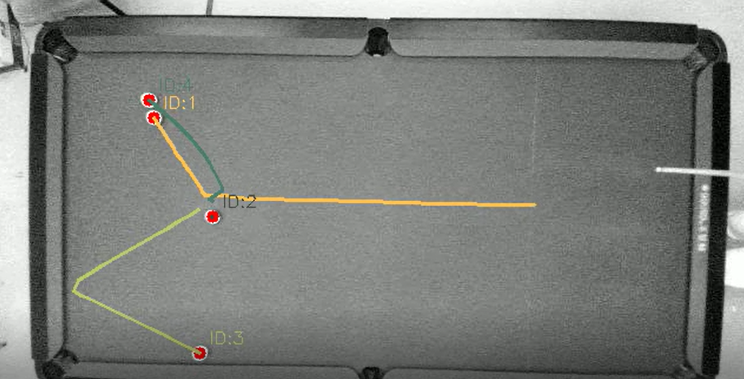
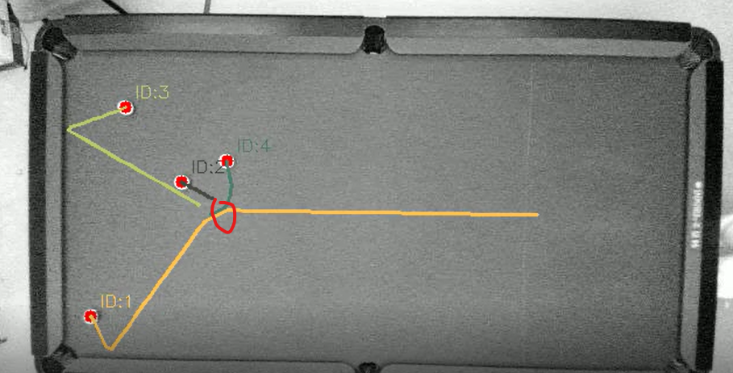

## 1. 测试流程


我们需要一个标准化的bad case测试和验证流程，其需要：

- 构建Bad Case数据集

  - 数据集获取：

    从监控网页中直接下载图像帧

- 构建追踪算法的测试脚本

  - 构建测试脚本：

    该测试脚本不是全流程测试脚本，该脚本加载数据集中边端推理检测模型的结果，在此基础上只验证追踪部分算法。是追踪部分的局部测试脚本。

  - 构建验证方法：

    未知数据集的真实结果，只能可视化推理结果进行检查

  后续基于相关滤波的追踪算法和深度学习的追踪算法均可使用该测试脚本，方便快速即插即用地验证。


## 2. 测试数据集格式

数据集总览如下：

```python
└──test_dataset
    ├──video_0001
    |   └──images                     # 存放视频帧的文件夹
    |       ├──frame_0001.jpg
    |       ├──frame_0002.jpg
    |       ...
    |       └──frame_XXXX.jpg
    ├──video_0002 
	...
    ├──video_XXXX
    └──data_info.txt                  # 用于说明该数据集的规格（视频规格，标注规格等）
```

其中每个视频用一个 `video_XXXX` 视频编号命名的文件夹承载。在每个视频对应的文件夹下：

- `images`文件夹：

  存放该条视频的所有视频帧，以 `.jpg` 格式存储；以 `frame_{四位数帧索引}.jpg` 命名。


## 3. 测试追踪算法的脚本


## 4. 方案尝试

我们在两个数据集上测试：

- test_dataset

  当前pipeline中失败案例。主要收集少数球情况下追踪错误案例。

- test_dataset2

  收集了多数球情况下的追踪失败案例（5条），和成功案例（5条）

  

### 4.1 传统相关滤波算法

#### Kalman Filter Tracker


- test_dataset/video_0001


- test_dataset/video_0002


- test_dataset/video_0003


- test_dataset/video_0004【失败】


- test_dataset/video_0005【失败】



- test_dataset/video_0006【失败】


- test_dataset/video_0007【失败】


- test_dataset/video_0008


- test_dataset/video_0009



- test_dataset/video_0010【失败】


- test_dataset/video_0011


- test_dataset/video_0012

一个基础版本的卡尔曼滤波追踪器，经过调参完备的kalman滤波+匹配算法，在我们的bad case数据集test_dataset一半以上的样本上成功，在五个样本（4,5,6,7,10）中失败。


#### Kalman Filter Tracker 2

一种匹配改进方法引用在基础版本的kalman滤波追踪器


- test_dataset/video_0004


- test_dataset/video_0005


- test_dataset/video_0006


- test_dataset/video_0007


- test_dataset/video_0010

一个改进版本的卡尔曼滤波追踪器，经过调参完备后，在我们的bad case数据集test_dataset**全部样本上成功**，在改进前失败的五个样本（4,5,6,7,10）中也能够正常追踪，如上图所示。

我们进一步测试了其在多数球情况下的表现（test_dataset2）：


- test_dataset2/video_0001


- test_dataset2/video_0002


- test_dataset2/video_0003


- test_dataset2/video_0004


- test_dataset2/video_0005

在多数球的bad case数据集样本中，依然全部成功追踪。


### 4.2 深度学习追踪算法

Dence Optical Tracking